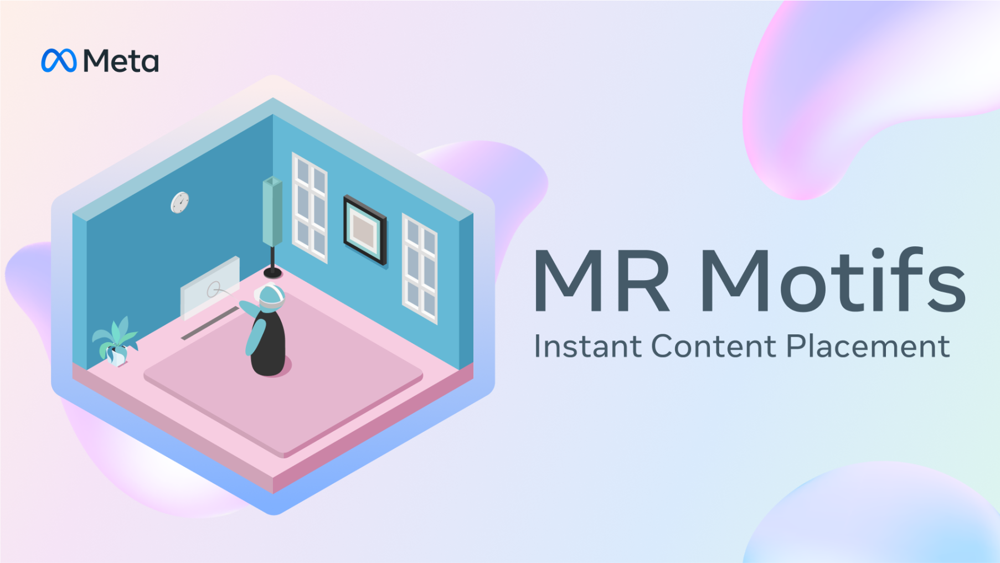
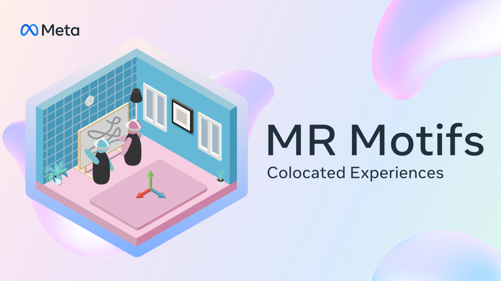
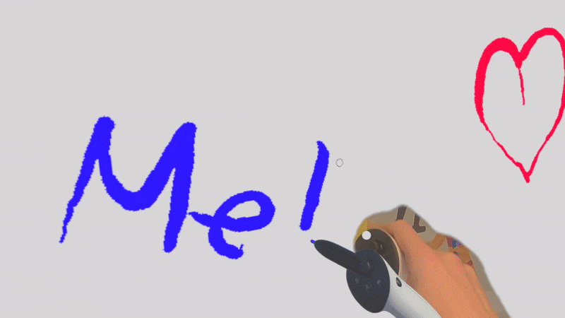

# MR Motifs - Create delightful Mixed Reality experiences


# Project Overview

Motifs are blueprints for recurring ideas that are expected, and have been observed, the community to build. They are not full applications, but rather recurring aspects of applications, which may require a collection of technical features and APIs to be achieved. MR Motifs teach MR best practices, inspire developers and spark new ideas. The goal is to stop developers from having to reinvent the wheel by providing them with a solid baseline for popular mechanics, that can be frequently observed.

Find more information in the [**`Developer Documentation`**](https://developers.meta.com/horizon/documentation/unity/)!

# Requirements

- [Unity 6](https://unity.com/releases/editor/whats-new/6000.0.40) (Recommended) or `Unity 2022.3 LTS`
- URP (Recommended) or BiRP
- Oculus XR Plugin (`4.3.0`) - com.unity.xr.oculus
- [Meta XR Core SDK](https://assetstore.unity.com/packages/tools/integration/meta-xr-core-sdk-269169) (`74.0.0`) - com.meta.xr.sdk.core
- [Meta XR Interaction SDK](https://assetstore.unity.com/packages/tools/integration/meta-xr-interaction-sdk-265014) (`74.0.0`) - com.meta.xr.sdk.interaction.ovr
- [Meta XR Interaction SDK Essentials](https://assetstore.unity.com/packages/tools/integration/meta-xr-interaction-sdk-essentials-264559) (`74.0.0`) - com.meta.xr.sdk.interaction

> [!CAUTION]
> If you plan to use the **OpenXR plugin**, be aware that the Avatar SDK does not yet support it. If you still would like to use the other MR Motif samples with **OpenXR**, make sure that, alongside the **OpenXR plugin**, you also install the Unity **OpenXR Meta plugin** (`com.unity.xr.meta-openxr@2.1.0-pre.1`), in order for the **Depth API** to work.

# MR Motifs Library

1. [Passthrough Transitioning](#passthrough-transitioning) - Seamlessly fade between Passthrough and VR
2. [Shared Activities in Mixed Reality](#shared-activities-in-mixed-reality) - Make people feel truly physically present with each other
3. [Instant Content Placement](#instant-content-placement--depth-effects) - Use the Depth API to create effects not possible otherwise
4. [Colocated Experiences]() - Seamlessly set up a colocated space for users to interact in

> [!NOTE]
> All scenes can be loaded from the [`MRMotifsHome`](./Assets/MRMotifs/MRMotifsHome.unity) scene which contains the `Menu Panel` [`prefab`](./Assets/MRMotifs/Shared%20Assets/Prefabs/Menu%20Panel.prefab) and [`script`](./Assets/MRMotifs/Shared%20Assets/Scripts/MenuPanel.cs), which holds a list of all the other scenes and which displays scene controls for each scene. The menu panel can be toggled by using the menu (start) button/gesture using hands and controllers. The menu panels are hidden in the Shared Activities scenes by default to not interfere with the object of interest.

# Passthrough Transitioning

[](https://www.youtube.com/watch?v=C9PFg-XfQcA)

Make sure to read through the [**Developer Documentation**](https://developers.meta.com/horizon/documentation/unity/unity-mrmotifs-passthrough-transitioning) for additional information!

This Motif shows the transition from fully immersive VR experiences, to passthrough mixed reality experiences, using the [Passthrough API](https://developer.oculus.com/documentation/unity/unity-passthrough/). It also addresses what passthrough is, and where and how it can and should be used. This project will allow users to adjust the visibility of their surroundings by manipulating a slider, which regulates the level of passthrough, or directly switch from one mode to another by the press of a button.

This MR Motif also teaches how to use the [Boundary API](https://developer.oculus.com/documentation/unity/unity-boundaryless/), to disable the guardian while in passthrough mode for a seamless MR experience!

## How it works

The fading between VR and passthrough is achieved by attaching a sphere to the main camera and manipulating it with a shader controlled by a custom fader class. This enables adjustable fade speed, direction, distance, and effects like dissolving in a random pattern. To set this up, use the custom [`PassthroughFader shader`](./Assets/MRMotifs/PassthroughTransitioning/Shaders/PassthroughFader.shader) and the [`PassthroughFader class`](./Assets/MRMotifs/PassthroughTransitioning/Scripts/PassthroughFader.cs) or a similar class to modify the shader's properties.

Ensure an OVR Camera Rig with OVR Manager is set up with Passthrough enabled. Enable Insight Passthrough on OVR Manager, use an OVR Passthrough Layer in Underlay mode, and add the Passthrough Fader prefab to the CenterEyeCamera. Reference the OVR Passthrough Layer in the [`Passthrough Fader component`](./Assets/MRMotifs/PassthroughTransitioning/Scripts/PassthroughFader.cs). Finally, set up a way to call the `TogglePassthrough` method of the PassthroughFader class using the Controller Buttons Mapper Building Block or the [`Menu Panel`](./Assets/MRMotifs/Shared%20Assets/Prefabs/Menu%20Panel.prefab) prefab.

## Contextual Passthrough

[Contextual passthrough](https://developers.meta.com/horizon/documentation/unity/unity-customize-passthrough-loading-screens/#configuring-system-splash-screen) determines if passthrough should be enabled based on the [system recommendation](https://developers.meta.com/horizon/documentation/unity/unity-passthrough-gs/#enable-based-on-system-recommendation). If the user is in passthrough mode at home, the system can detect this and display the splash screen and Unity scene in passthrough. In VR mode, the splash screen appears with a black background as usual.

> [!TIP]
> If Passthrough (Contextual) is enabled but the effect can still not be observed at startup, make sure to update the AndroidManifest.xml. Go to Meta > Tools > Update the Android Manifest xml. Also, currently Passthrough (Contextual) for the system splash screen can only be enabled with a Unity Pro license.

## Conditional Passthrough

Passthrough can switch between MR and VR modes or reveal parts of the environment, like menus or scene changes, enhancing immersion and extending play sessions. Since enabling passthrough is asynchronous, system resources like cameras take milliseconds to activate, causing a black flicker. Prevent this by using the [passthroughLayerResumed](https://developer.oculus.com/documentation/unity/unity-passthrough-gs/#wait-until-passthrough-is-ready) event, which signals when passthrough is fully initialized. To ensure a smooth transition, use a [`shader`](./Assets/MRMotifs/PassthroughTransitioning/Shaders/PassthroughFader.shader) instead of switching instantly.

## Passthrough Transitioning Sample Scenes

Both scenes come with a PassthroughFader prefab, which is located on the centerEyeAnchor. It contains the PassthroughFader class. The prefab also contains an audio source, that is used to play audio clips whenever a fade-in or fade-out starts and/or stops.

|                  PassthroughFader Underlay                   |                  PassthroughFaderDissolve                    |
| :----------------------------------------------------------: | :----------------------------------------------------------: |
|       |     |

The passthrough fader slider scene includes the [`PassthroughFaderSlider`](./Assets/MRMotifs/PassthroughTransitioning/Prefabs/PassthroughFaderSlider.prefab) prefab on `centerEyeAnchor`, containing the [`PassthroughFaderSlider`](./Assets/MRMotifs/PassthroughTransitioning/Scripts/PassthroughSlider.cs) component. The passthrough dissolver scene has the [`PassthroughDissolver`](./Assets/MRMotifs/PassthroughTransitioning/Prefabs/PassthroughDissolver.prefab) prefab **outside** `centerEyeAnchor` so the dissolution pattern stays anchored in the scene. It contains the [`PassthroughDissolver`](./Assets/MRMotifs/PassthroughTransitioning/Scripts/PassthroughDissolver.cs) class. The default [`PassthroughDissolver`](./Assets/MRMotifs/PassthroughTransitioning/Shaders/PassthroughDissolver.shader) shader applies to a sphere, requiring the [`PerlinNoiseTexture`](./Assets/MRMotifs/PassthroughTransitioning/Scripts/PerlinNoiseTexture.cs) script to generate a modifiable texture. If using [`PassthroughDissolverSG`](./Assets/MRMotifs/PassthroughTransitioning/Shaders/PassthroughDissolverSG.shadergraph), remove [`PerlinNoiseTexture`](./Assets/MRMotifs/PassthroughTransitioning/Scripts/PerlinNoiseTexture.cs) since the texture is generated within ShaderGraph, with everything else functioning the same.

## Main components in the Passthrough Transitioning MR Motif

### PassthroughFader class

This script demonstrates how to check if [passthrough is recommended](https://developers.meta.com/horizon/documentation/unity/unity-passthrough-gs/#enable-based-on-system-recommendation), [wait until passthrough is ready](https://developers.meta.com/horizon/documentation/unity/unity-passthrough-gs/#wait-until-passthrough-is-ready), and how to toggle between VR and passthrough smoothly in the [PassthroughToggle method](./Assets/MRMotifs/PassthroughTransitioning/Scripts/PassthroughFader.cs#L196). The [`PassthroughFader`](./Assets/MRMotifs/PassthroughTransitioning/Scripts/PassthroughFader.cs) script is a component that contains both Underlay and Selective passthrough modes and lets the user decide which to use in the inspector.

|                  PassthroughFader Underlay                   |                  PassthroughFader Selective                  |
| :----------------------------------------------------------: | :----------------------------------------------------------: |
|       |      |

The Fade Speed and Fade Direction can be adjusted. The same goes for the `Selective Distance` in `Selective Passthrough mode`, which limits virtual content visibility within a set range. This is useful for tabletop games or interactions requiring focus on surroundings. The [`PassthroughFader`](./Assets/MRMotifs/PassthroughTransitioning/Scripts/PassthroughFader.cs) class includes four Unity Events that notify when fade-in and fade-out start and complete, useful for triggering actions like playing an audio clip.

### PassthroughFaderSlider and PassthroughDissolver classes

The project contains a **[`PassthroughFaderSlider`](./Assets/MRMotifs/PassthroughTransitioning/Scripts/PassthroughFaderSlider.cs)** script, similar to `PassthroughFader`, but allowing manual fading via a slider. It also demonstrates turning off the guardian when a threshold is crossed. The **[`PassthroughDissolver`](./Assets/MRMotifs/PassthroughTransitioning/Scripts/PassthroughDissolver.cs)** works similarly but adjusts the dissolve level instead of the inverted alpha value.

Other scripts in the Passthrough Transitioning samples:
- **[`AudioController`](./Assets/MRMotifs/PassthroughTransitioning/Scripts/AudioController.cs)** reads the inverted alpha value and adjusts volume.
- **[`PerlinNoiseTexture`](./Assets/MRMotifs/PassthroughTransitioning/Scripts/PerlinNoiseTexture.cs)** generates textures for the PassthroughDissolver shader.
- **[`Perlin Noise`](https://docs.unity3d.com/ScriptReference/Mathf.PerlinNoise.html)** settings allow unique dissolve effects at runtime.

## Shaders

### PassthroughFader HLSL

Passthrough Transitioning uses a shader for smooth fading between VR and passthrough. The **[`PassthroughFader`](./Assets/MRMotifs/PassthroughTransitioning/Shaders/PassthroughFader.shader)** HLSL shader handles fading in the fragment shader by adjusting the alpha channel based on fade direction and inverted alpha value.

- `_InvertedAlpha` inverts transparency for the fading effect.
- `_FadeDirection` controls fade direction:
  - `0`: Uses the red channel
  - `1`: Right to left
  - `2`: Top to bottom
  - `3`: Center outwards

All transitions are smoothed with `smoothstep`.

> [!IMPORTANT]
> Since this shader is applied inside a sphere, **Culling** must be turned off (`Cull Off`). Also, set the **Render Queue** to `Transparent-1 (2999)` to ensure it renders behind transparent and opaque materials, preventing **z-fighting** (flickering).

### PassthroughDissolver HLSL & ShaderGraph

To add a stylish effect when fading between VR and passthrough, use the **[`PassthroughFaderDissolve`](./Assets/MRMotifs/PassthroughTransitioning/Scenes/PassthroughFaderDissolve.unity)** scene. It utilizes the **[`PassthroughDissolver`](./Assets/MRMotifs/PassthroughTransitioning/Scripts/PassthroughDissolver.cs)** class to manipulate either the **[`PassthroughDissolver`](./Assets/MRMotifs/PassthroughTransitioning/Shaders/PassthroughDissolver.shader)** or **[`PassthroughDissolverSG`](./Assets/MRMotifs/PassthroughTransitioning/Shaders/PassthroughDissolverSG.shadergraph)** shader, adjusting the dissolve level to reveal passthrough in a pattern.

- **[`PassthroughDissolver`](./Assets/MRMotifs/PassthroughTransitioning/Shaders/PassthroughDissolver.shader)** uses the **[`PerlinNoiseTexture`](./Assets/MRMotifs/PassthroughTransitioning/Scripts/PerlinNoiseTexture.cs)** script to generate the pattern.
- **[`PassthroughDissolverSG`](./Assets/MRMotifs/PassthroughTransitioning/Shaders/PassthroughDissolverSG.shadergraph)** generates the texture directly inside ShaderGraph.

# Shared Activities in Mixed Reality

[](https://www.youtube.com/watch?v=ZaW47wZJb0k)

Make sure to read through the [**Developer Documentation**](https://developers.meta.com/horizon/documentation/unity/unity-mrmotifs-shared-activities) for additional information!

Create convincing shared activities in MR that encourage authentic, intuitive interactions with the Shared Activities in Mixed Reality motif. This project uses the [Multiplayer Building Blocks](https://developers.meta.com/horizon/documentation/unity/bb-multiplayer-blocks) to quickly and effortlessly set up a networked experience using the [networked Meta Avatars](https://developers.meta.com/horizon/documentation/unity/meta-avatars-networking). The goal of this motif is then to show developers, how to easily extend the Building Blocks and build custom shared experiences, such as chess and movie co-watching, on top of them.

## Additional Requirements

When using the **Shared Activities** MR Motif, there are several additional requirements that need to be met in order to use the full functionality of this sample. The Multiplayer Building Blocks provide integration with two popular multiplayer frameworks: [`Unity Netcode for Game Objects`](https://docs-multiplayer.unity3d.com/netcode/current/about/) and [`Photon Fusion 2`](https://doc.photonengine.com/fusion/current/fusion-intro).

Both multiplayer frameworks are supported at parity with the exception of the Player Voice Chat block that is only available for Photon Fusion, which is the main reason why **`this MR Motif will be based on Photon Fusion 2`**. The underlying concept of this sample should be easily transferable to Unity Netcode.
- [Meta Avatars SDK](https://assetstore.unity.com/packages/tools/integration/meta-avatars-sdk-271958) (`31.0.0`) - com.meta.xr.sdk.avatars
> [!CAUTION]
> The Avatar SDK is currently not compatible yet with OpenXR. If you are planning to use this sample, you will need to keep using the Oculus XR Plugin.
- [Meta Avatars SDK Sample Assets](https://assetstore.unity.com/packages/tools/integration/meta-avatars-sdk-sample-assets-272863) (`31.0.0`) - com.meta.xr.sdk.avatars.sample.assets: Required by Networked Avatar block to show a set of pre-set Meta Avatars in the editor when testing.
> [!CAUTION]
> Building Blocks are currently not compatible with Avatars v33 or later. Avatars are not moving with the OVR Rig.
- [Meta XR Platform SDK](https://assetstore.unity.com/packages/tools/integration/meta-xr-platform-sdk-262366) (`74.0.0`) - com.meta.xr.sdk.platform: Required by Player Name Tag and Networked Avatar blocks. Also required to retrieve data such as the player's avatar and name, as well as check the entitlement and connect to create group presence to use the friends invite feature.
- [Meta XR Simulator](https://assetstore.unity.com/packages/tools/integration/meta-xr-simulator-266732) (`74.0.0`) - com.meta.xr.simulator
  (Optional): For multiplayer testing without the need for many headsets.
- [Photon Fusion](https://assetstore.unity.com/packages/tools/network/photon-fusion-267958) (`2.0.5`)
- [Photon Voice](https://assetstore.unity.com/packages/tools/audio/photon-voice-2-130518) (`2.57`)
> [!TIP]
> Make sure to go through the **[Import Photon Voice](https://doc.photonengine.com/voice/current/getting-started/voice-for-fusion)** setup guide.
- [ParrelSync](https://github.com/VeriorPies/ParrelSync) (`1.5.2`)
  (Optional): Creates and maintains multiple Unity editor instances of the same project for easier multiplayer testing.

## Shared Activities Sample Scenes

The [`MRMotifsHome`](./Assets/MRMotifs/MRMotifsHome.unity) scene now includes "[MR Motif] Quest Platform Setup," containing an Entitlement Check (from Multiplayer Building Blocks) and **[`InvitationAcceptanceHandlerMotif`](./Assets/MRMotifs/SharedActivities/Scripts/Quest%20Platform/InvitationAcceptanceHandlerMotif.cs)**. This handles when a [friend is invited](https://developers.meta.com/horizon/documentation/unity/ps-invite-overview/) to the multiplayer scene, checks their entitlement, and determines the destination scene. It currently supports **chess** and **movie cowatching** but should be updated with the API and scene names. Create [destinations](https://developers.meta.com/horizon/documentation/unity/ps-destinations-overview) via the Developer Dashboard under Engagement > Destinations. Ensure the Data Use Check Up is set correctly by following [this section](#how-the-multiplayer-setup-works).

|                        Chess Sample                          |                   Movie Cowatching Sample                    |
| :----------------------------------------------------------: | :----------------------------------------------------------: |
|                    |                    |


The **chess sample** scene updates chess piece positions and rotations like the **[`AvatarMovementHandlerMotif`](./Assets/MRMotifs/SharedActivities/Scripts/Avatars/AvatarMovementHandlerMotif.cs)**. The **[`ChessBoardHandlerMotif`](./Assets/MRMotifs/SharedActivities/Scripts/Chess%20Sample/ChessBoardHandlerMotif.cs)** assigns State Authority to players moving pieces and syncs their networked transforms. It toggles Rigidbody between physics (for the authority) and kinematic (for others). Using Photon Fusion's **IStateAuthorityChanged** interface, it waits for authority transfer before allowing movement. The board has four spawn points, which can be increased by adding more and assigning the **[`SpawnPointMotif`](./Assets/MRMotifs/SharedActivities/Scripts/Spawning/SpawnPointMotif.cs)** class.

The **movie cowatching** logic in **[`MovieControlsHandlerMotif`](./Assets/MRMotifs/SharedActivities/Scripts/Movie%20Sample/MovieControlsHandlerMotif.cs)** differs from the previous sample, as it synchronizes UI elements (button/toggle states) instead of transforms. It uses Networked Properties like `NetworkBools` and `NetworkedFloats` to track slider values and toggle states. The `IStateAuthorityChanged` interface ensures actions are executed by the correct player. Currently, there are 4 spawn locations set in front of the chess board.

## Multiplayer setup & troubleshooting

Find a detailed setup and troubleshooting guide in the [Developer Documentation](https://developers.meta.com/horizon/documentation/unity/unity-mrmotifs-shared-activities).

## Main components in the Shared Activities MR Motif

This MR Motif's [scripts folder](./Assets/MRMotifs/SharedActivities/Scripts/) is subdivided into 5 folders, each hosting concise and easy-to-follow classes:
- **Avatars**
  - **[`AvatarMovementHandlerMotif`](./Assets/MRMotifs/SharedActivities/Scripts/Avatars/AvatarMovementHandlerMotif.cs)**: Manages the synchronization of networked avatar positions and rotations. It childs the remote avatars to the object of interest to make them move with the object. The class ensures that both local and remote avatars are correctly positioned relative to a central "object of interest" by updating their transforms across clients whenever the object is moved or interacted with, maintaining consistency in the multiplayer environment.
  - **[`AvatarNameTagHandlerMotif`](./Assets/MRMotifs/SharedActivities/Scripts/Avatars/AvatarNameTagHandlerMotif.cs)**: Manages the attachment of name tags to the heads of remote avatars. It waits for the avatars to be initialized and then dynamically parents the name tag to each avatar's head, ensuring that the name tags correctly follow the avatars' movements in the MR environment.
  - **[`AvatarSpawnerHandlerMotif`](./Assets/MRMotifs/SharedActivities/Scripts/Avatars/AvatarSpawnerHandlerMotif.cs)**: Manages the spawning and positioning of avatars. It utilizes [`SpawnManagerMotif`](./Assets/MRMotifs/SharedActivities/Scripts/Spawning/SpawnManagerMotif.cs) to assign spawn locations, releases these locations when players exit, and optionally handles group presence features like friend invites for a more interactive multiplayer experience.
  - **[`AvatarSpeakerHandlerMotif`](./Assets/MRMotifs/SharedActivities/Scripts/Avatars/AvatarSpeakerHandlerMotif.cs)**: Manages the assignment of voice speakers to remote avatars using Photon Voice. It waits for avatars to be initialized and then dynamically attaches a speaker component to each remote avatar's head, ensuring that voice is correctly positioned and synchronized with the avatars in the MR environment.
- **Chess Sample**
  - **[`ChessBoardHandlerMotif`](./Assets/MRMotifs/SharedActivities/Scripts/Chess%20Sample/ChessBoardHandlerMotif.cs)**: Manages the synchronization of networked chess piece positions and rotations very similarly to the [`AvatarMovementHandlerMotif`](./Assets/MRMotifs/SharedActivities/Scripts/Avatars/AvatarMovementHandlerMotif.cs). It handles player interactions with the chess pieces such as selecting and moving them and updates their states across all clients, providing networked audio feedback to ensure consistent and interactive gameplay in a multiplayer environment. It also supports physics which is the reason why, as opposed to the [`AvatarMovementHandlerMotif`](./Assets/MRMotifs/SharedActivities/Scripts/Avatars/AvatarMovementHandlerMotif.cs), updates of the positions and rotations are sent every frame instead of only when the pieces are moved, to account for falling or moving pieces due to physics.
- **Helpers**
  - **[`ConstraintInjectorMotif`](./Assets/MRMotifs/SharedActivities/Scripts/Helpers/ConstraintInjectorMotif.cs)**: Dynamically injects rotation constraints into the GrabFreeTransformer component of a GameObject. It is used to limit the rotation of interactive objects like the chessboard and movie screen in sample scenes, ensuring they rotate only within specified bounds during user interaction.
  - **[`HandleAnimationMotif`](./Assets/MRMotifs/SharedActivities/Scripts/Helpers/HandleAnimationMotif.cs)**: Controls the smooth scaling and transparency transitions of a GameObject during hover interactions. It listens for hover and unhover events using an InteractableUnityEventWrapper and employs coroutines to animate the object's scale and material alpha over a set duration, enhancing visual feedback during user interaction. This is used by the movie panel handle.
- **Movie Sample**
  - **[`MovieControlsHandlerMotif`](./Assets/MRMotifs/SharedActivities/Scripts/Movie%20Sample/MovieControlsHandlerMotif.cs)**: Manages networked user interactions with a video player. It synchronizes playback controls like play/pause, volume, settings, and timeline adjustments across all connected clients, ensuring consistent video playback and UI states in a multiplayer environment.
- **Quest Platform**
  - **[`GroupPresenceAndInviteHandlerMotif`](./Assets/MRMotifs/SharedActivities/Scripts/Quest%20Platform/GroupPresenceAndInviteHandlerMotif.cs)**: Manages [group presence](https://developers.meta.com/horizon/documentation/unity/ps-group-presence-overview) and [friend invitations](https://developers.meta.com/horizon/documentation/unity/ps-invite-overview) using the Oculus Platform SDK. It allows users to set their session as joinable with specific destination and session IDs, and provides functionality to launch the invite panel so users can invite friends to join their multiplayer session.
  - **[`InvitationAcceptanceHandlerMotif`](./Assets/MRMotifs/SharedActivities/Scripts/Quest%20Platform/InvitationAcceptanceHandlerMotif.cs)**: Manages [deep link invitations](https://developers.meta.com/horizon/documentation/unity/ps-deep-linking/) using the Oculus Platform SDK. When the app is launched via a deep link (e.g., from a friend's invitation), it checks the launch details to map the provided destination API name to a scene and automatically loads that scene, directing the user to the appropriate multiplayer session.

- **Spawning**
  - **[`SpawnManagerMotif`](./Assets/MRMotifs/SharedActivities/Scripts/Spawning/SpawnManagerMotif.cs)**: Manages player spawn locations. It controls a queuing system for players waiting for available spawn points, ensuring avatars are correctly positioned at these locations, and prevents conflicts by assigning unique spawn positions to each player as they join the session.
  - **[`SpawnPointMotif`](./Assets/MRMotifs/SharedActivities/Scripts/Spawning/SpawnPointMotif.cs)**: Serves as a marker component in the scene to designate player spawn points. It is used by the [`SpawnManagerMotif`](./Assets/MRMotifs/SharedActivities/Scripts/Spawning/SpawnManagerMotif.cs) to identify and manage these spawn locations but contains no additional logic beyond being attached to GameObjects as an identifier.

# Instant Content Placement & Depth effects

[](https://www.youtube.com/watch?v=VEdtonM5pGs)

Read through the [**Developer Documentation**](https://developers.meta.com/horizon/documentation/unity/unity-mrmotifs-instant-content-placement) for additional information!

Version 71 of the Meta XR Core SDK introduced the **[MRUK Raycast API](https://developers.meta.com/horizon/documentation/unity/unity-mr-utility-kit-features#environment-raycasting-beta)** in public beta. It is designed for applications that want to place a 2D panel or 3D object somewhere in front of the user with minimal setup and effort required. This can be helpful when placing a board game on a table or sticking a UI panel to a wall, for example. The requirements for this placement are minimal: The user should simply look in the direction of the placement. This enables the users to put on a headset in a room they’ve never been to before, and immediately start interacting with both 2D and 3D content.

## Additional Requirements

- [**Meta MR Utility Kit**](https://assetstore.unity.com/packages/tools/integration/meta-mr-utility-kit-272450) (`74.0.0`) - com.meta.xr.mrutilitykit
> [!TIP]
> This sample runs with OpenXR. Simplz makes sure that, alongside the **OpenXR plugin**, you also install the Unity **OpenXR Meta plugin** (`com.unity.xr.meta-openxr@2.1.0-pre.1`). This is necessary for using the Depth API.

## How it works

To place an object in a room, there is no need for colliders at all, instead the new [`EnvironmentRaycastManager`](https://developers.meta.com/horizon/documentation/unity/unity-mr-utility-kit-features#environment-raycasting-beta) is utilized, which heavily relies on the `EnvironmentDepthManager`. The basic concept of placing an object using the EnvironmentRaycastManager looks like the following:

   ```
   EnvironmentRaycastManager.Raycast(new Ray(origin, direction), out var hitInfo)
   ```

   Therefore, the most simple bare bones instant placement logic could look something like this:

   ```
  using Meta.XR.MRUtilityKit;
  using UnityEngine;

  public class BasicInstantPlacement : MonoBehaviour
  {
      public Transform Object;
      public EnvironmentRaycastManager RaycastManager;

      void Update()
      {
          // Check if a surface is hit below the object
          if (RaycastManager.Raycast(new Ray(Object.position, Vector3.down), out var hitInfo))
          {
              // Position the object on the hitpoint/detected surface
              Object.position = hitInfo.point;
          }
      }
  }
   ```

   The important part here is the `EnvironmentRaycastManager.Raycast` method. It performs a raycast against the environment and returns a hit result with information such as the hit point, normal of the surface hit, and normal confidence. This is already all the information needed to detect a surface and place any object on that surface. The Raycast API, part of MRUK, is as easy to work with as Unity’s [`Physics.Raycast`](https://docs.unity3d.com/ScriptReference/Physics.Raycast.html), which most Unity developers will already be familiar with.

## Sample Scenes

Two samples scene come with this MR Motif. The `Depth Effects` scene shows off various visual effects that can be achieved by utilizing the information coming form the EnvironmentDepthManager directly in the shaders. The Instant Content Placement scene demonstrates how to use Raycasting to detetct and place surfaces. The project also contains a separate shader to render a shadow below the object and cut it off whenever it extends a surface, such as a table, just like a real shadow.
|                        Depth Effects                           |                   Instant Content Placement                     |
| :----------------------------------------------------------:   | :----------------------------------------------------------:    |
|                    |          |

## Custom Shaders

This MR Motif includes several sample shaders designed to assist developers in quickly creating custom occlusion shaders. For example, the [`DepthLookingGlassMotif`](./Assets/MRMotifs/InstantContentPlacement/Shaders/DepthLookingGlassMotif.shader) shader visualizes depth maps on objects such as quads, displaying both physical and virtual object depth to enhance gameplay interactions. To visualize virtual objects accurately, ensure they use opaque shaders, as transparent objects do not write to Unity's depth buffer. To achieve invisible objects that still affect depth, the [`DepthMaskMotif`](./Assets/MRMotifs/InstantContentPlacement/Shaders/DepthMaskMotif.shader) shader can be applied. Additionally, for virtual depth visualization, depth textures must be enabled in the camera's rendering settings or the Universal Render Pipeline asset.

The Depth Effects scene demonstrates two additional visual effects. The [`DepthRelightingMotif`](./Assets/MRMotifs/InstantContentPlacement/Shaders/DepthRelightingMotif.shader) shader applies a glow or lighting effect directly to the depth map, shown by the blue glow of the orb moving through the environment. The [`DepthScanEffectMotif`](./Assets/MRMotifs/InstantContentPlacement/Shaders/DepthScanEffectMotif.shader) shader is applied to an invisible sphere, expanding over time and coloring intersections with the depth map to produce a shockwave effect. The image below illustrates the ShaderGraph implementation of the Orb, providing an example of how occlusion can be integrated into existing shaders. Additional details are available in the [`Depth API GitHub repository`](https://github.com/oculus-samples/Unity-DepthAPI).

Lastly, the project contains the [`GroundingShadowMotif`](./Assets/MRMotifs/InstantContentPlacement/Shaders/GroundingShadowMotif.shader) shader which displays a shadow texture and is able to compare virtual and physical depth, to discard the pixels of the texture, wherever the shadow extends over a surface, such as a table.

# Colocated Experiences

[](#)

Read through the [**Developer Documentation**](https://developers.meta.com/horizon/documentation/unity/unity-mrmotifs-colocated-experiences) for additional information!

Version 71 of the Meta XR Core SDK introduced the [Group-based anchor loading](https://developers.meta.com/horizon/documentation/unity/unity-shared-spatial-anchors#understanding-group-based-vs-user-based-spatial-anchor-sharing-and-loading), as well as [Colocation Discovery](https://developers.meta.com/horizon/documentation/unity/unity-colocation-discovery). Followed by v74, which introduced the powerful [MRUK Space Sharing API](https://developers.meta.com/horizon/documentation/unity/space-sharing-overview). This MR Motif will demonstrate everything, from the very basics of [Spatial Anchors](https://developers.meta.com/horizon/documentation/unity/unity-spatial-anchors-persist-content), through how to share them over the network, to how to set up co-located experiences using [Colocation Discovery](https://developers.meta.com/horizon/documentation/unity/unity-colocation-discovery). Furthermore, the project includes a guide on how to set up the new [MRUK Space Sharing API](https://developers.meta.com/horizon/documentation/unity/space-sharing-overview), allowing developers to build colocated apps where all participants can leverage detailed information about their physical surroundings with MRUK. The project also contains the new [Microgestures](https://developers.meta.com/horizon/documentation/unity/unity-microgestures), allowing users to interact with the shared Whiteboard sample in the project, using controllers and hands equally.

## Additional Requirements

- [**Meta MR Utility Kit**](https://assetstore.unity.com/packages/tools/integration/meta-mr-utility-kit-272450) (`74.0.0`) - com.meta.xr.mrutilitykit
- [**Meta XR Platform SDK**](https://assetstore.unity.com/packages/tools/integration/meta-xr-platform-sdk-262366) (`74.0.0`) - com.meta.xr.sdk.platform
- [**Photon Fusion**](https://assetstore.unity.com/packages/tools/network/photon-fusion-267958) (`2.0.5`)

## Spatial Anchors
An anchor is a world-locked frame of reference that gives a position and orientation to a virtual object in the real world. In this MR Motif, we demonstrate the whole lifecycle of a spatial anchor, from its creation to its persistence and retrieval. The project provides a [`Spatial Anchors folder`](./Assets/MRMotifs/ColocatedExperiences/Scripts/Spatial%20Anchors/), containing the [`SpatialAnchorManager`](./Assets/MRMotifs/ColocatedExperiences/Scripts/Spatial%20Anchors/SpatialAnchorManager.cs) class for creating, saving, and erasing spatial anchors, the [`SpatialAnchorLoader`](./Assets/MRMotifs/ColocatedExperiences/Scripts/Spatial%20Anchors/SpatialAnchorLoader.cs) class for loading previously saved anchors, and the static [`SpatialAnchorStorage`](./Assets/MRMotifs/ColocatedExperiences/Scripts/Spatial%20Anchors/SpatialAnchorStorage.cs) class For managing the anchor's UUIDs and saving them to the [`Unity PlayerPrefs`](https://docs.unity3d.com/6000.0/Documentation/ScriptReference/PlayerPrefs.html).

It is best practice to await each action and/or check if the action was successfully completed before continuing. For creation there is not
`OVRSpatialAnchor` method, instead an anchor can be created by simply instantiating a prefab that contains the OVRSpatialAnchor component, or taking an existing object in the scene and adding the OVRSpatialAnchor component to it. This assigns a UUID and creates the anchor asynchronously.

```
var anchor = gameObject.AddComponent<OVRSpatialAnchor>();

while (!anchor.Created)
{
      await Task.Yield();
}
```

The anchor contains a property called Created to check if the creation is already successfully completed. It is good practice to wait until the anchor has been created before continuing.

For other action such as saving, erasing, and loading, the anchor provides methods that return a task that can be awaited.

```
// Save an anchor
await anchor.SaveAnchorAsync();

// Load an anchor
var unboundAnchors = new List<OVRSpatialAnchor.UnboundAnchor>();
await OVRSpatialAnchor.LoadUnboundAnchorsAsync(uuids, unboundAnchors);

// Localize an anchor
await unboundAnchor.LocalizeAsync();

// Bind an anchor
unboundAnchor.BindTo(spatialAnchor);

// Erase an anchor
await anchor.EraseAnchorAsync();
Destroy(anchor.gameObject);
```

## Shared Spatial Acnhors & Colocation Discovery

As of v71, Spatial Anchor sharing and loading is [groups instead of user based](https://developers.meta.com/horizon/documentation/unity/unity-shared-spatial-anchors#understanding-group-based-vs-user-based-spatial-anchor-sharing-and-loading). This eliminates the need for users to be [entitled to the app](https://developers.meta.com/horizon/documentation/unity/ps-entitlement-check) and therefore for developers to manage user IDs through their verified app on the Developer Dashboard. Instead, an arbitrary group UUID is used for sharing and loading anchors, making Group Sharing the recommended approach.

Before sharing a spatial anchor with a group, one of the participants, usually the host, must create a single UUID representing the group and communicate it to the others. The method of that communication can be either via an app-managed network connection, such as [Unity Netcode](https://docs-multiplayer.unity3d.com/netcode/current/about/) or [Photon Fusion](https://www.photonengine.com/fusion), or via [Colocation Discovery](https://developers.meta.com/horizon/documentation/unity/unity-colocation-discovery), which greatly reduces end-user friction around setting up colocated experiences.

The project provides a [`Colocation folder`](./Assets/MRMotifs/ColocatedExperiences/Scripts/Colocation/), containing the [`SharedSpatialAnchorManager`](./Assets/MRMotifs/ColocatedExperiences/Scripts/Colocation/SharedSpatialAnchorManager.cs) class for managing the colocation process, from Colocation Advertisement and Discovery over Sharing and Loading anchors. Furthermore it contains the [`ColocationManager`](./Assets/MRMotifs/ColocatedExperiences/Scripts/Colocation/ColocationManager.cs) class, responsible for aligning the user to the tracking space of the host.

### Colocation Discovery: Advertisement & Anchor Sharing

The group ID is automatically generated as the result of advertising. In the code below, the host starts the advertisement. After successful advertisement we can read the group ID from the advertisement result.

```
var advertisementResult = await OVRColocationSession.StartAdvertisementAsync(null);
_groupId = advertisementResult.Value;

// Create and save anchor here
```

After creating and saving our spatial anchor as we learned in the previous section, we are then able to call the group-based function for sharing anchors.

```
OVRSpatialAnchor.ShareAsync(new List<OVRSpatialAnchor> { anchor }, _groupId);
```

### Colocation Discovery: Discovery & Anchor Loading

After the host has started advertising the session and has successfully shared the anchor, including the created group ID, all other users are ready to discover the session. Below you can see that we subscribe to the OnColocationSessionDiscovered event and then start the Discovery with StartDiscoveryAsync.

```
OVRColocationSession.ColocationSessionDiscovered += OnColocationSessionDiscovered;
OVRColocationSession.StartDiscoveryAsync();
```

```
private void OnColocationSessionDiscovered(OVRColocationSession.Data sessionData)
{
    _groupId = session.AdvertisementUuid;
    var unboundAnchors = new List<OVRSpatialAnchor.UnboundAnchor>();
    await OVRSpatialAnchor.LoadUnboundSharedAnchorsAsync(_groupId, unboundAnchors);
}
```

Next, the users are ready to be aligned to the anchor’s pose. This is necessary for a truly colocated experience and so that the users have the same tracking space as the host. To do this we can simply adjust the position and rotation of the user's Camera Rig to the anchor’s pose.

```
cameraRig.Transform.position = anchor.Transform.InverseTransformPoint(Vector3.zero);
cameraRig.Transform.eulerAngles = new Vector3(0, -anchor.Transform.eulerAngles.y, 0);
```

## Space Sharing

 A popular use case when doing colocation is to also share the room layout with other users. With version 74 of the Meta XR SDK we did introduce just that. MRUK now hosts a powerful [Space Sharing API](https://developers.meta.com/horizon/documentation/unity/space-sharing-overview), making it extremely easy and seamless to share rooms across clients in a co-located experience. All requirements and a troubleshooting guide can be found in the [**Developer Documentation**](https://developers.meta.com/horizon/documentation/unity/unity-mrmotifs-instant-content-placement).

 This MR Motif combines the Space Sharing API with Colocation Discovery, which makes this whole setup extremely straightforward. To share a room, all the host has to do is to talk to the MRUK singleton instance, get a list of MRUK rooms, and call the built-in ShareRoomsAsync method.

```
// For sharing multiple rooms
var rooms = MRUK.Instance.Rooms;
MRUK.Instance.ShareRoomsAsync(rooms, _groupId);

// For sharing a single (current) room
var room = MRUK.Instance.GetCurrentRoom();
room.ShareRoomAsync(_groupId);
```

Similarly it is possible for the other users to load all rooms shared with the group ID and align themselves to the room’s floor world pose.

```
MRUK.Instance.LoadSceneFromSharedRooms(null, _groupId, alignmentData: (roomUuid, remoteFloorWorldPose));
```

## Sample Scenes

This project contains two additional sample scenes for [Colocation Discovery](./Assets/MRMotifs/ColocatedExperiences/Scenes/ColocationDiscovery.unity), as well as [Space Sharing](./Assets/MRMotifs/ColocatedExperiences/Scenes/SpaceSharing.unity), which demonstrate how to build a seamless colocated experience.

|                        Shared Whiteboard                       |                   Shared Bouncing Ball Spawner              |
| :----------------------------------------------------------:   | :------------------------------------------------------:    |
|           |            |

# Health and safety guidelines

When building mixed reality experiences, we highly recommend evaluating your
content from a health and safety perspective to offer your users a comfortable
and safe experience. Please read the
[Mixed Reality H&S Guidelines](https://developer.oculus.com/resources/mr-health-safety-guideline/)
before designing and developing your app using this sample project, or any of
our Presence Platform features.

Developers should avoid improper occlusion, which occurs when virtual content
does not respect the physicality of the user’s environment. Improper Occlusion
can result in a misperception of actionable space.

- See
  [Occlusions with Virtual Content](https://developer.oculus.com/resources/mr-health-safety-guideline/#passthrough)

- To avoid improper occlusion, developers should ensure that users have (1)
  completed Space Setup and (2) granted Spatial Data permission (setup design)
  to allow proper occlusion in content placement, mesh collisions, and air
  navigation.

Using semi-transparent content lets the user have a better view of their
physical space and reduces the occlusion of objects or people that are not part
of the scanned mesh.

- Spatial data won’t incorporate dynamic elements of a user’s living space (for
  example, a chair that was moved after capture or a moving person/pet in the
  space).

- Uncaptured dynamic elements may be occluded by virtual content, making it more
  difficult for a user to safely avoid such hazards while engaged in the mixed
  reality experience.

Respect the user’s personal space. Avoid having virtual content pass through
their body or loom close to their face. When content crosses into a user’s
personal space they may experience a psychological or visual discomfort, or take
actions to avoid the virtual content that may increase the risk of injury or
damage (for example, backing up into a wall or chair). Dynamic virtual content
may also distract the user from their surroundings.

# License

This codebase is available as both a reference and a template for mixed reality
projects. MR Motif is licensed under [MIT LICENSE](./LICENSE).

See the [CONTRIBUTING](./CONTRIBUTING.md) file for how to help out.
