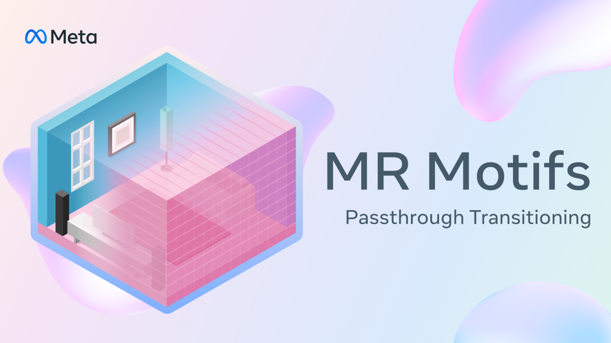
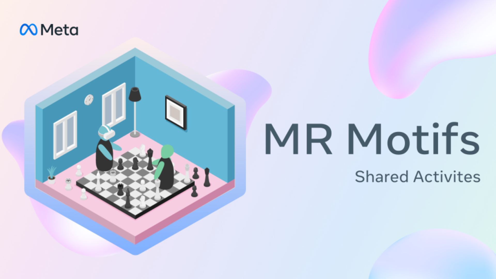
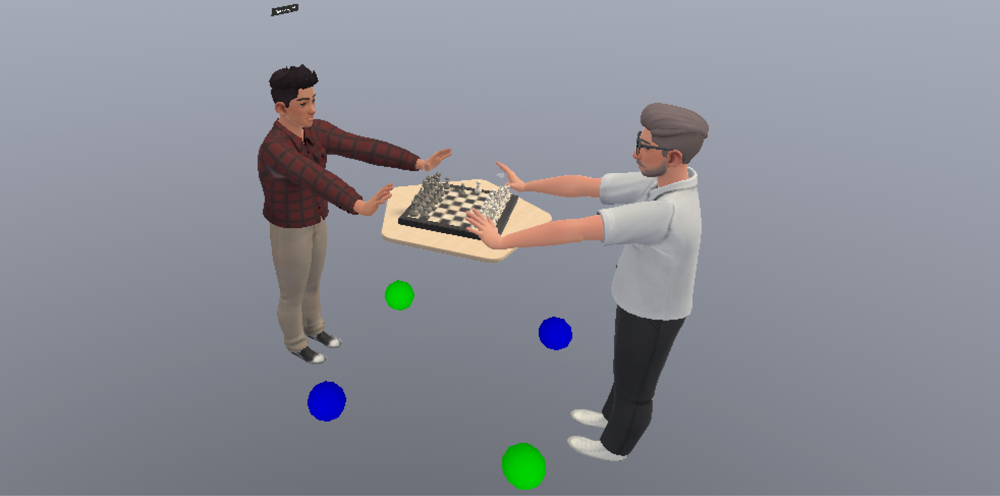
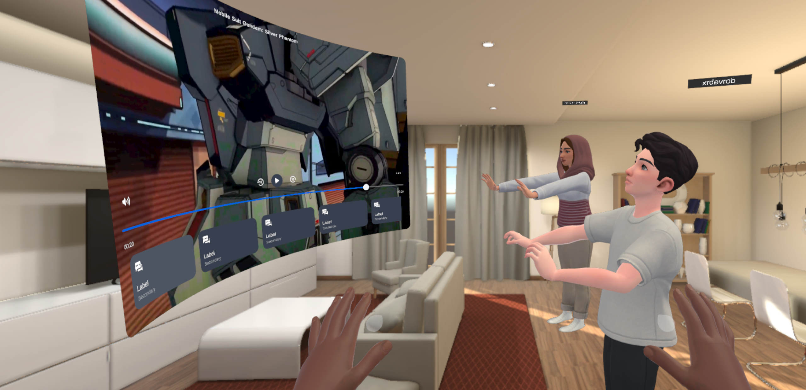

# MR Motifs - Create delightful Mixed Reality experiences


# Project Overview

Motifs are blueprints for recurring ideas which we expect, and have observed, our community to build. They are not full applications, but rather recurring aspects of applications, which may require a collection of technical features and APIs to be achieved. With MR Motifs we would like to teach MR best practices, inspire developers and spark new ideas. Our goal is to stop developers from having to reinvent the wheel by providing them with a solid baseline for popular mechanics, which we frequently observe.

You can find even more tips and tricks on [how to design Mixed Reality experiences](https://developer.oculus.com/resources/mr-overview/) in our [Developer Resources](https://developer.oculus.com/resources/)!

# General Requirements

- Unity 2022.3.38 (Recommended) or later
- URP (Recommended) or BiRP
- Meta XR Core SDK (71.0.0) - com.meta.xr.sdk.core
- Meta XR Interaction SDK (71.0.0) - com.meta.xr.sdk.interaction.ovr
- Meta XR Interaction SDK Essentials (71.0.0) - com.meta.xr.sdk.interaction

# MR Motifs Library

1) [Passthrough Transitioning](#passthrough-transitioning) - Seamlessly fade between Passthrough and VR
2) [Shared Activities in Mixed Reality](#shared-activities-in-mixed-reality) - Make people feel truly physically present with each other
3) Coming Soon!

> [!IMPORTANT]
> All scenes can be loaded from the [MRMotifsHome](./Assets/_MRMotifs/MRMotifsHome.unity) scene which contains the Menu Panel [prefab](./Assets/_MRMotifs/_Shared/Prefabs/Menu%20Panel.prefab) and [script](./Assets/_MRMotifs/_Shared/Scripts/MenuPanel.cs), which holds a list of all the other scenes and which displays scene controls for each scene. The menu panel can be toggled by using the menu (start) button/gesture using hands and controllers. The menu panels are hidden in the Shared Activities scenes by default to not interfere with the object of interest.

## Passthrough Transitioning

[](https://www.youtube.com/watch?v=C9PFg-XfQcA)

With this Motif we would like to show the transition from fully immersive VR experiences, to passthrough mixed reality experiences, using the [Passthrough API](https://developer.oculus.com/documentation/unity/unity-passthrough/). We also want to address what passthrough is, and where and how it can and should be used. With this project you will be able to adjust the visibility of your surroundings by manipulating a slider, which regulates the level of passthrough, or directly switch from one mode to another by the press of a button.

> [!TIP]
> This MR Motif also shows you how to use the [Boundary API](https://developer.oculus.com/documentation/unity/unity-boundaryless/), to disable the guardian while in passthrough mode for a seamless MR experience!

### How it works

We fade between VR and passthrough by setting a sphere as the child of our main camera. We then manipulate the sphere by using a shader which we manipulate at runtime with a custom fader class. This allows us to achieve different capabilities such as adjusting fade speed, fade direction, fade distance and even effects like dissolving the sphere in a randomly generated pattern. All you need to set this up in your project is the custom [PassthroughFader shader](./Assets/_MRMotifs/PassthroughTransitioning/Shaders/PassthroughFader.shader) from this project and the [PassthroughFader class](./Assets/_MRMotifs/PassthroughTransitioning/_Samples/Scripts/PassthroughFader.cs) class or a similar class to manipulate the shader's properties!

Make sure to have an OVR Camera Rig with OVR Manager and the Passthrough supported. Also enable Insight Passthrough on the OVR Manager. Use an OVR Passthrough Layer on Underlay mode, add the Passthrough Fader prefab to the centereyecamera, and reference the OVR Passthrough Layer on the [Passthrough Fader component](./Assets/_MRMotifs/PassthroughTransitioning/_Samples/Scripts/PassthroughFader.cs). Lastly, set up a way to call the public TogglePassthrough method of the PassthroughFader class. You can use the Controller Buttons Mapper Building Block or the [Menu Panel prefab](./Assets/_MRMotifs/_Shared/Prefabs/Menu%20Panel.prefab).

### Contextual Passthrough

[Contextual passthrough](https://developers.meta.com/horizon/documentation/unity/unity-customize-passthrough-loading-screens/#configuring-system-splash-screen) means if passthrough should be enabled based on [system recommendation](https://developers.meta.com/horizon/documentation/unity/unity-passthrough-gs/#enable-based-on-system-recommendation). In other words, if the user is in passthrough mode in his home environment, our operating system can detect this and display the system splash screen as well as our Unity scene in passthrough as well. In VR mode, the system splash screen will be shown with a black background like before.

> [!IMPORTANT]
> If you enabled Passthrough (Contextual) and can still not see the effect being applied, make sure to update your AndroidManifest.xml. For this you need to go to “Meta” then “Tools” and then update the Android Manifest file. Also, currently Passthrough (Contextual) for the system splash screen can only be enabled with a Unity Pro license.

|                  Splash Screen (Black)                       |               Splash Screen (Passthrough Contextual)         |
| :----------------------------------------------------------: | :----------------------------------------------------------: |
|        |        |

### Conditional Passthrough

Passthrough can also be used to switch between MR and VR game modes or to conditionally show parts of the environment, such as when opening menus or changing scenes. This allows players to feel more comfortable and immersed, leading to longer play sessions. Keep in mind that enabling passthrough is asynchronous. System resources like cameras can take a few hundred milliseconds to be activated, during which time passthrough is not yet rendered and experienced as black flicker. You can avoid that by using the [passthroughLayerResumed](https://developer.oculus.com/documentation/unity/unity-passthrough-gs/#wait-until-passthrough-is-ready) event, which is emitted once the layer is fully initialized and passthrough is visible. Additionally, we don’t just want to immediately go from passthrough to VR but rather use a [shader](./Assets/_MRMotifs/PassthroughTransitioning/Shaders/PassthroughFader.shader) to smoothly transition between the two.

### Passthrough Transitioning Sample Scenes

|                  PassthroughFader Underlay                   |                  PassthroughFader Selective                  |
| :----------------------------------------------------------: | :----------------------------------------------------------: |
|       |     |

Both scenes come with a PassthroughFader prefab, which is located on the centerEyeAnchor. It contains the PassthroughFader class. The prefab also contains an audio source, that is used to play audio clips whenever we fade in or out.

|                  PassthroughFaderSlider                      |                  PassthroughFaderDissolve                    |
| :----------------------------------------------------------: | :----------------------------------------------------------: |
|         |      |

The passthrough fader slider scene comes with a PassthroughFaderSlider prefab, which is located on the centerEyeAnchor. It contains the PassthroughFaderSlider component. The passthrough dissolver scene comes with a PassthroughDissolver prefab, which is located **outside** the centerEyeAnchor, so that the dissolution pattern does not move with our head but instead stay anchored in the scene. It contains the PassthroughDissolver class. By default we applied the PassthroughDissolver shader to the sphere, therefore we need the PerlinNoiseTexture script to generate a texture for us, which we can easily modify by changing the values in the inspector. If you were to use the PassthroughDissolverSG ShaderGraph shader, you can simply remove the PerlinNoiseTexture component since the texture is already generated within the ShaderGraph, everything else works the same.

### Main components in the Passthrough Transitioning MR Motif

#### PassthroughFader class

This script shows you how to check if [passthrough is recommended](https://developers.meta.com/horizon/documentation/unity/unity-passthrough-gs/#enable-based-on-system-recommendation), [wait until passthrough is ready](https://developers.meta.com/horizon/documentation/unity/unity-passthrough-gs/#wait-until-passthrough-is-ready), and how to toggle between VR and passthrough smoothly in the [PassthroughToggle method](./Assets/_MRMotifs/PassthroughTransitioning/_Samples/Scripts/PassthroughFader.cs#L196). The [PassthroughFader](./Assets/_MRMotifs/PassthroughTransitioning/_Samples/Scripts/PassthroughFader.cs) script is a component that contains both Underlay and Selective passthrough modes and lets the user decide which to use in the inspector. You will be fine just using this one script and setting your desired mode in the dropdown, instead of using the separate [PassthroughFaderUnderlay](./Assets/_MRMotifs/PassthroughTransitioning/Scripts/PassthroughFaderUnderlay.cs) and [PassthroughFaderSelective](./Assets/_MRMotifs/PassthroughTransitioning/_Samples/Scripts/PassthroughFaderSelective.cs.meta) scripts.

|                  PassthroughFader Underlay                   |                  PassthroughFader Selective                  |
| :----------------------------------------------------------: | :----------------------------------------------------------: |
| ||

We can adjust Fade Speed and Fade Direction. Additionally, we can change the Selective Distance, which is only relevant when using the Selective Passthrough mode. This distance allows us to only show virtual content up until a predefined distance when in Passthrough. This can be useful for use cases like tabletop games or interaction where the user needs to be especially focussed on their surroundings. The PassthroughFader class comes with four Unity Events that will inform us when a fade-out and fade-in was started and completed. This comes in handy when you want to e.g. play an audio clip.

#### PassthroughFaderSlider and PassthroughDissolver classes

Additionally, we prepared a [PassthroughFaderSlider](./Assets/_MRMotifs/PassthroughTransitioning/Scripts/PassthroughFaderSlider.cs) script, that has mostly the same logic as the PassthroughFader above but allows you to slowly fade between VR and Passthrough manually, using a slider. Furthermore, here we show you how to turn off the guardian when a certain threshold has been crossed. The [PassthroughDissolver](./Assets/_MRMotifs/PassthroughTransitioning/_Samples/Scripts/PassthroughDissolver.cs) works very similarly with the exception that we don't adjust the inverted alpha value with our slider but the dissolve level instead.

Other scripts that are part of the Passthrough Transitioning samples are the [AudioController](./Assets/_MRMotifs/PassthroughTransitioning/_Samples/Scripts/AudioController.cs), which is responsible for reading the inverted alpha value from the material and adjusts the volume accordingly. The [PerlinNoiseTexture](./Assets/_MRMotifs/PassthroughTransitioning/_Samples/Scripts/PerlinNoiseTexture.cs) generates a texture for our PassthroughDissolver shader. With the [Perlin Noise](https://docs.unity3d.com/ScriptReference/Mathf.PerlinNoise.html) settings we can generate unique dissolve effects at runtime.

### Shaders

#### PassthroughFader HLSL

The Passthrough Transitioning utilizes a shader to achieve a smooth fading between VR and passthrough. The shader used by the Passthrough Fader and Slider is the [PassthroughFader](./Assets/_MRMotifs/PassthroughTransitioning/Shaders/PassthroughFader.shader) HLSL shader. The fragment shader handles fading effects by adjusting the alpha channel of the texture based on the specified fade direction and inverted alpha value. The _InvertedAlpha parameter inverts the alpha transparency, creating a fading effect, while the _FadeDirection parameter controls the direction of the fade. The _FadeDirection modifies the alpha value by interpolating based on the UV coordinates: direction 0 uses the red channel, 1 fades from right to left, 2 fades from top to bottom, and 3 fades from the center outwards, with all transitions smoothed by smoothstep.

> [!IMPORTANT]
> Since we are inside a sphere where we apply this shader to, we need to make sure to turn cullign off (Cull Off). Also, make sure to keep the render queue at Transparent-1 (2999) to render behind transparent and opaque materials to prevent z-fighting (flickering).

#### PassthroughDissolver HLSL & ShaderGraph

For you to not only fade between VR and passthrough but also achieve a fancy effect we included the [PassthroughFaderDissolve](./Assets/_MRMotifs/PassthroughTransitioning/_Samples/Scenes/PassthroughFaderDissolve.unity) scene which uses the [PassthroughDissolver](./Assets/_MRMotifs/PassthroughTransitioning/_Samples/Scripts/PassthroughDissolver.cs) class to manipulate either the [PassthroughDissolver](./Assets/_MRMotifs/PassthroughTransitioning/_Samples/Shaders/PassthroughDissolver.shader) or the [PassthroughDissolverSG](./Assets/_MRMotifs/PassthroughTransitioning/_Samples/Shaders/PassthroughDissolverSG.shadergraph) shader material and adjusts the level of dissolution to reveal passthrough in a pattern. The pattern in the case of [PassthroughDissolver](./Assets/_MRMotifs/PassthroughTransitioning/_Samples/Shaders/PassthroughDissolver.shader) comes from the [PerlinNoiseTexture](./Assets/_MRMotifs/PassthroughTransitioning/_Samples/Scripts/PerlinNoiseTexture.cs) script. For the [PassthroughDissolverSG](./Assets/_MRMotifs/PassthroughTransitioning/_Samples/Shaders/PassthroughDissolverSG.shadergraph) shader the texture is generated already inside the ShaderGraph.

## Shared Activities in Mixed Reality

[](https://www.youtube.com/watch?v=C9PFg-XfQcA)

This MR Motif focuses on how to create convincing shared activities in MR that encourage authentic, intuitive interactions. In VR, everyone shares the same virtual spaces and objects, and moving an object or anchor like a chess board or movie panel affects all users equally, which is what multiplayer frameworks are designed for. In MR, however, each user wants to place their own local board or screen, as moving it for everyone may look correct for Client A, but causes a misalignment in Client B's room. This poses a challenge not present in traditional VR.

### Additional Requirements

When using the **Shared Activities** MR Motif, there are several additional requirements that need to be met in order to use the full functionality of this sample. The Multiplayer Building Blocks provide integration with two popular multiplayer frameworks: [Unity Netcode for Game Objects](https://docs-multiplayer.unity3d.com/netcode/current/about/) and [Photon Fusion 2](https://doc.photonengine.com/fusion/current/fusion-intro).

> [!NOTE]
> Both multiplayer frameworks are supported at parity with the exception of the Player Voice Chat block that is only available for Photon Fusion, which is the main reason why **this MR Motif will be based on Photon Fusion 2**. The underlying concept of this sample should be easily transferable to Unity Netcode.

- [Meta Avatars SDK (31.0.0)](https://assetstore.unity.com/packages/tools/integration/meta-avatars-sdk-271958) - com.meta.xr.sdk.avatars

  > [!CAUTION]
  > The Multiplayer Building Blocks are only compatible with the latest Meta Avatar SDK (29.7.0) from v71 (currently v69) onwards, therefore we still use the Meta Avatars SDK (24.1.1) here. This will be updated as soon as v71 is publicly available!

- [Meta Avatars SDK Sample Assets (31.0.0)](https://assetstore.unity.com/packages/tools/integration/meta-avatars-sdk-sample-assets-272863) - com.meta.xr.sdk.avatars.sample.assets

  Required by Networked Avatar block to show a set of pre-set Meta Avatars in the editor when testing.

- [Meta XR Platform SDK (71.0.0)](https://assetstore.unity.com/packages/tools/integration/meta-xr-platform-sdk-262366) - com.meta.xr.sdk.platform

  Required by Player Name Tag and Networked Avatar blocks. Also required to retrieve data such as the player's avatar and name, as well as check the entitlement and connect to create group presence to use the friends invite feature.

- [Meta XR Simulator (71.0.0)](https://assetstore.unity.com/packages/tools/integration/meta-xr-simulator-266732) - com.meta.xr.simulator

  (Optional) For multiplayer testing without the need for many headsets.

- [Photon Fusion (2.0.3)](https://assetstore.unity.com/packages/tools/network/photon-fusion-267958)
- [Photon Voice (2.55)](https://assetstore.unity.com/packages/tools/audio/photon-voice-2-130518)

  > [!NOTE]
  > Make sure to go through the **[Import Photon Voice](https://doc.photonengine.com/voice/current/getting-started/voice-for-fusion)** setup guide.

- [ParrelSync (1.5.2)](https://github.com/VeriorPies/ParrelSync)

  (Optional) Creates and maintains multiple Unity editor instances of the same project for easier multiplayer testing.

### Basic Concept of Shared Activities in MR

The animation below shows how the basic concept of this Shared Activities MR Motif works. In MR, each user wants to place their own local board or screen in their individual space, as moving it for everyone else may look correct for Client A, but causes a misalignment in Client B's room. A solution to this problem is to manipulate the remote avatars’ position and rotation, instead of the anchor’s (e.g. chess board), so that each player positions the board in the most convenient place for them, while still keeping other players in their accurate relative position and rotation to the board. So let’s say Client B is across the board from Client A, one meter behind their board and turning their head 45 degrees away from the board. Client A can at all times move their board wherever they want, while still seeing Client B in the correct relative position and rotation, so in this case 1 unit behind their board with their head 45 degrees rotated.


### Shared Activities Sample Scenes

The [MRMotifsHome](./Assets/_MRMotifs/MRMotifsHome.unity) scene now contains a GameObject called "[MR Motif] Quest Platform Setup", which contains an Entitlement Check class, coming from the Multiplayer Building Blocks, and a new class called **[InvitationAcceptanceHandlerMotif](./Assets/_MRMotifs/SharedActivities/Scripts/Quest%20Platform/InvitationAcceptanceHandlerMotif.cs)**. This is responsible for handling when a [friend has been invited](https://developers.meta.com/horizon/documentation/unity/ps-invite-overview/) to your multiplayer scene, checking if they are entitled and then determining which scene destination (scene) they have been invited to. Currently it contains [destinations](https://developers.meta.com/horizon/documentation/unity/ps-destinations-overview) for the **chess** and the **movie cowatching** scenes but you will want to update those with your own API and scene names. You can create [destinations](https://developers.meta.com/horizon/documentation/unity/ps-destinations-overview) by going to your Developer Dashboard under Engagement > Destinations. Make sure the Data Use Check Up has been set up correctly by following [this section](#how-the-multiplayer-setup-works).

|                        Chess Sample                          |                   Movie Cowatching Sample                    |
| :----------------------------------------------------------: | :----------------------------------------------------------: |
|                    |                    |


The **chess sample** scene demonstrates how to update the position and rotation of other objects (chess pieces) similarly to the **[AvatarMovementHandlerMotif](./Assets/_MRMotifs/SharedActivities/Scripts/Avatars/AvatarMovementHandlerMotif.cs)**. The **[ChessBoardHandlerMotif](./Assets/_MRMotifs/SharedActivities/Scripts/Chess%20Sample/ChessBoardHandlerMotif.cs)** is responsible for assigning State Authority to the player trying to move a piece and updating the networked positions and rotations relative to the chess board. It also switches the Rigidbody of the chess pieces for the State Authority to using physics and for everyone else to kinematic. In that, all other clients simply update the transform according to the State Athority's physics simulation. Notable here is that we integrate the **IStateAuthorityChanged** interface from Photon Fusion, which allows us to wait for the State Authority to be given to the player that requested it, or in this case tries to grab a chess piece. Currently, there are four spawn locations set around the chess board, this can easily be increased by simply creating more spawn locations and assigning the **[SpawnPointMotif](./Assets/_MRMotifs/SharedActivities/Scripts/Spawning/SpawnPointMotif.cs)** class to them.



The **movie cowatching** logic in the **[MovieControlsHandlerMotif](./Assets/_MRMotifs/SharedActivities/Scripts/Movie%20Sample/MovieControlsHandlerMotif.cs)** is slightly different to the previous sample, since we do not synchronize transforms but UI elements, such as button and toggle states. However, we still use Networked Properties such as Networkbools and Networked floats to keep a record of what value a slider currently has, or if a toggle is currently on or not. Here we also use the **IStateAuthorityChanged** for each action to be executed by the right player. Currently, there are 4 spawn locations set in front of the chess board.

### Multiplayer setup & achieving successful entitlement checks

To build a multiplayer experience with the Meta XR SDK, there are really just a couple of steps to keep in mind. Make sure you go through each step!

1) After installing all requirements from above, we **set up a multiplayer scene** with the following Building Blocks:
   - **[BuildingBlock] Camera Rig**: On the Camera Rig feel free to add any additional Building Blocks such as grab and ray interaction or hands and controller tracking. Or simply use the OVRCameraRig prefab from the MR Motifs shared folder.

   - **[BuildingBlock] Passthrough**: Make sure the centereyecamera's Background Type is set to Solid Color and set the Background Color's alpha to 0.
   - **[BuildingBlock] Network Manager**: Contains the heart of any multiplayer session: [Network Runner](https://doc.photonengine.com/fusion/current/manual/network-runner) and Network Events.
   > [!NOTE]
   > With our Multiplayer Building Blocks we are not using the Network Events directly, instead we are using the FusionBBEvents, which wraps the INetworkRunnerCallbacks from Photon Fusion and exposes them as static events, allowing multiple classes to subscribe and respond to them, without having to directly implement the INetworkRunnerCallbacks interface. It simplifies event handling, promotes modularity, and enables cleaner code by decoupling network logic from other game systems.
   - **[BuildingBlock] Platform Init**: This component is responsible for initializing the Meta platform, fetching the access token, and checking if the user is entitled to access the platform. This is later necessary to load the avatar, based on the user’s account and if they are entitled.

   - **[BuildingBlock] Auto Matchmaking**: Here sits the component which is responsible for connecting us to the right game mode (shared) and room. By default every client will simply be spawned in the same room.
   - **[BuildingBlock] Networked Avatar**: Responsible for spawning the local and remote Meta Avatars and syncing their movement over the network.
   - **[BuildingBlock] Player Name Tag**: Responsible for spawning a name tag above the avatar with the user’s name or, if the user is not logged in, a random name.
   - **[BuildingBlock] Player Voice Chat**: Responsible for setting up the voice chat and creating a speaker for each avatar.

2) A crucial part of a multiplayer set up, using Meta Avatars, is the **[entitlement check](https://developers.meta.com/horizon/documentation/unity/unity-platform-entitlements)**, which makes it possible to use all the amazing Meta Platform features and see your friend's and your own avatars in your experience:

   1) Create a developer account on the **[Meta Quest Dashboard](https://developer.oculus.com/manage/applications)**, and either create or join an organization and create your app (Meta Horizon Store).

   2) Retrieve its App ID by navigating to the Development > API section. Find the ID under “App ID - Used to initialize the Platform SDK”.
   3) Add this App ID to your Unity project through the Unity Editor under Meta > Platform > Edit Settings, under Application ID.
   4) Complete your Data Use Check Up for your app, which can be found under Requirements > Data Use Check Up in your Dashboard. For using the **Meta Avatars**, we need to fill the usage for **User ID**, **User Profile**, and **Avatars**. Make sure that for all of them you select “Use Avatars” under “Usage” and write an arbitrary description such as “Using Meta Avatars in my multiplayer experience” under “Description”.
   5) If you'd like to use other platform features such as the **Friends Invite** feature we will show you in this MR Motif, then you will need to fill out additional Data Use Check Ups, such as **Deep Linking**, **Friends**, and **Invites**. Do not forget in this case, to [create one or more destinations](https://developers.meta.com/horizon/documentation/unity/ps-destinations-overview#create-a-single-destination-in-the-developer-dashboard) first. You will later need the API name and Deep Link Message in order to invite friends to your experience.
   6) After creating these usages you might have to also submit a certification, if you haven’t done so already, to be able to submit your request. If everything was filled out correctly, the request should be accepted in a few minutes in most cases.
   7) In the Unity Editor under the platform settings, if you are developing only for Quest standalone, you can fill the same ID into both fields. We can check the “Use Standalone Platform” check box. We then go back to our Dashboard. Under Development > Test Users, we would like to create a new Test User. This helps us test our app with another account besides our own, which can be helpful for debugging. Make sure to at least fill in the prefixes and the password. Remember or note down the password since you will not be able to retrieve it later. Now, in your Unity Editor under Meta > Platform > Edit Settings, under “Unity Editor Settings”, click on the check box for “Use Standalone Platform” and fill in your Test User credentials, and then log in.
   8) Lastly, **we need to [upload](https://developers.meta.com/horizon/documentation/unity/unity-prepare-for-publish) an APK of our experience to a release channel of our app**, e.g. the Alpha channel. We use the **[Meta Quest Developer Hub](https://developers.meta.com/horizon/documentation/unity/ts-odh/)** for this. Under App Distribution we select our organization and the application we want to upload our APK to. Make sure everyone testing your app is part of your organization or is invited as alpha tester. To be extra sure, you can also **additionally** install the same APK version on the devices through the Device Manager in the Meta Quest Developer Hub.

3) After setting up our scene with the Multiplayer Building Blocks, and making sure that we pass the entitlement check, we are now ready to build truly shared experiences.



### Known issues as of Core v71 & Avatars v31

- Leg animations for avatars are currently not supported with the Network Avatar Building Block
- On the Network Avatar Building Block the number of avatar presets needs to be set to 17 or less for the Avatars SDK v28+ since less Avatar presets are available. Otherwise you might experiene the Avatar to appear purple.
- There can be the issue of Name Tags and Audio Sources of remote players not appearing in the correct position. A restart currently fixes this issue, however it can happen more often with weaker internet connection. This is caused by a prolonged loading of the Avatar's asset with v28+.
- The movement of avatars currently can seems choppy when they are moving their own object (e.g. Chess board), we are working on interpolating the movement so it will appear smoother in the future. Also, due to the fact that the new avatars (v28+) all contain legs, more data has to be synchronized over the network which can cause lag in weak networks.

### Multiplayer Troubleshooting

Multiplayer development is not easy. However, following our setup guide should make sure that your app runs as expected. Below is a list of issues developers commonly face:

- **An avatar appears blue/purple**: This indicates that the avatar asset could not be loaded. Make sure there are either avatar sample assets assigned in Unity or you are entitled to use this app (see setup above). The issue could also be caused by the number of avatar presets you are trying to load. On the Avatar Spawner Fusion class, located on the Networked Avatar Building Block, make sure the Preloaded Sample Avatar Size is 17 or less for the Avatar SDK v28 or higher, or 32 or less for older versions.
- **I cannot see other avatars**: This is a known issue. If this is happening in your editor, make sure to pan your camera around and move to where you expect the other player to be for its visuals to show up. On the headset, move around or simply wait a few seconds for the other clients to show up. If you still do not see them, it is most likely that the entitlement failed on your or the other client.
- **Can't copy CoreAssets from package folder to Avatar2 Assets folder error**: Simply delete the CoreAssets folders found in the Avatar2 folder under Assets > Oculus > Avatar2 and restart your editor for the package to correctly copy the right core assets into your project.
- **.zip assets missing error from the Meta Avatar SDK Sample Assets package**: Copy the missing files from the packages (Meta Avatars SDK and Meta Avatars SDK Sample Assets) into the corresponding Assets folders, or reinstall the Meta Avatars SDK Sample Assets.
- **Missing Fusion namespaces**: Close Unity, delete the Photon folder under Assets, open Unity and reimport Fusion 2 as well as Photon Voice.
- **Missing BuildingBlock namespaces, even though Meta Core SDK is installed**: This means some of your scripts are throwing errors before the packages have had a chance to compile. This usually happens when adding and removing the Photon folder during your development process. It most likely means your build settings did not clear the **Scripting Define Symbols** in the **Player Settings**. In that case make sure there are no symbols such as **FUSION_WEAVER**, **FUSION2**, or **PHOTON_VOICE_DEFINED**, before Photon Fusion 2 is imported!
- **I cannot upload my APK through the Meta Quest Developer Hub**: This can have many reasons and we ask you to read the exact error message. More often than not, the upload fails because of a **missing or unnecessary permission in your Android Manifest**. To make your Android manifest compatible with the store, we created an editor script that takes care of this for you. You can go to Meta, then Tools, and then click on [Create store-compatible AndroidManifest.xml](https://developers.meta.com/horizon/documentation/unity/unity-prepare-for-publish#generate-manifest-file). However, if there are still unwanted Android permissions present, that you cannot remove either manually or with our editor script, then you can do so by explicitly removing the permission directly within your Android Manifest file. This is how you might remove a permission that is unexpectedly appearing. Simply add this line to your AndroidManifest.xml file in Unity:

   ```
   <uses-permission android:name="android.permission.THE_UNWANTED_PERMISSION" tools:node="remove" />
   ```

### How to move Avatars and other GameObjects in a Shared Mixed Reality Activity

Generally, in Shared Mixed Reality Activities you don't want to just share and network one object, such as a chess board, since anytime a player moves the board, the board will move for you too, potentially causing the board to be misaligned in your room. Therefore we want to maintain a local copy of our own chess board, and simply tell all other players where our local avatar is relative to our own chess board. We do that by letting the State Authority maintain [networked arrays](https://doc.photonengine.com/fusion/current/manual/data-transfer/networked-properties) of positions and rotations, which are being updated by all individual players when they are moving their local chess board. Every player can then read from these networked arrays each frame (or as needed), to keep all avatars in the correct relative position.

1) **Understanding the basics**: At the heart of the Avatar movement is the **AvatarEntity**. The **AvatarEntity** class handles the loading, configuration, and synchronization of Meta Avatars in a multiplayer environment by streaming avatar state data, such as position and rotation. The **AvatarBehaviourFusion** class integrates this system with Photon Fusion, networking the avatar's state across clients, ensuring that each client has updated information about remote avatars. Together, they allow for avatars to be dynamically loaded and synchronized in real-time, while the Fusion implementation handles the transmission. The **AvatarBehaviourFusion** class sits on the FusionAvatar prefab, which is being spawned into our Fusion scene by the Networked Avatar Building Block, more specifically by the **AvatarSpawnerFusion** class. This class manages spawning of the **FusionAvatar** prefab, as well as entitlement checks.

2) **What components of the Avatars can and can't be manipulated**
   - **What components can't be manipulated**
     - **AvatarEntity**: The AvatarEntity makes the avatar's head and hands move according to our local main camera and body tracking coming from the OVR Manager. This happens every frame and we do not interfere here because this is what gives our Avatars their natural movement. Therefore, we also cannot move the remote avatar's head or chest.
     - **Centereyecamera**: We cannot set the main camera's transform at runtime, because it is controlled by our headset.
     - **OVR Camera Rig**: Since the OVR Camera Rig is where our main camera sits, moving the OVR Camera Rig will also move our local avatar. This is what we use in the **[AvatarSpawnerHandlerMotif](./Assets/_MRMotifs/SharedActivities/Scripts/Avatars/AvatarSpawnerHandlerMotif.cs)** to initially position and rotate our local avatar towards the object of interest after spawning. However, afterwards we do not want to touch the OVR Camera Rig anymore, mainly because we do not have direct access to the remote players' OVR Camera Rig, and therefore it would make updating its transform very hard.
   - **What components can be manipulated**: The part of each remote avatar we can move without fear of causing any unwanted behaviour is the parent object itself containing the **AvatarBehaviourFusion** component, as you can see in the **[AvatarMovementHandlerMotif](./Assets/_MRMotifs/SharedActivities/Scripts/Avatars/AvatarMovementHandlerMotif.cs)** class. Think of it as the "remote version" of another player's OVR Camera Rig. When moving the **AvatarBehaviourFusion**, we can influence the Avatar's position and rotation that is controlled by the head, or in other words, the "remote version" of the other player's camera. Whenever another player moves, they are sending their new position and rotation to the networked list. We then read from that list and position their remote avatar in the same relative location to our object as they are to theirs, making it so everyone enjoys the same experience while having total control of where they want to place their chess board.

     > [!IMPORTANT]
     > By moving the remote avatars already ourselves by using our networked arrays of positions and rotations as described at the beginning of [this section](#how-to-move-avatars-and-other-gameobjects-in-a-shared-activity-in-mixed-reality) it becomes clear that we do not rely on the Networked Transfrom component of Photon Fusion anymore. You can see in the [AvatarMovementHandlerMotif](./Assets/_MRMotifs/SharedActivities/Scripts/Avatars/AvatarMovementHandlerMotif.cs) class, that we are disabling the Network Transform component for each remote avatar. Leaving this component enabled would mean Fusion applies additional offsets to the remote avatars which would misalign them from our local chess board.

### Main components in the Shared Activities MR Motif

This MR Motif's [scripts folder](./Assets/_MRMotifs/SharedActivities/Scripts/) is subdivided into 5 folders, each hosting concise and easy-to-follow classes:
- **Avatars**
  - **[AvatarMovementHandlerMotif](./Assets/_MRMotifs/SharedActivities/Scripts/Avatars/AvatarMovementHandlerMotif.cs)**: Manages the synchronization of networked avatar positions and rotations. It childs the remote avatars to the object of interest to make them move with the object. The class ensures that both local and remote avatars are correctly positioned relative to a central "object of interest" by updating their transforms across clients whenever the object is moved or interacted with, maintaining consistency in the multiplayer environment.
  - **[AvatarNameTagHandlerMotif](./Assets/_MRMotifs/SharedActivities/Scripts/Avatars/AvatarNameTagHandlerMotif.cs)**: Manages the attachment of name tags to the heads of remote avatars. It waits for the avatars to be initialized and then dynamically parents the name tag to each avatar's head, ensuring that the name tags correctly follow the avatars' movements in the MR environment.
  - **[AvatarSpawnerHandlerMotif](./Assets/_MRMotifs/SharedActivities/Scripts/Avatars/AvatarSpawnerHandlerMotif.cs)**: Manages the spawning and positioning of avatars. It utilizes [SpawnManagerMotif](./Assets/_MRMotifs/SharedActivities/Scripts/Spawning/SpawnManagerMotif.cs) to assign spawn locations, releases these locations when players exit, and optionally handles group presence features like friend invites for a more interactive multiplayer experience.
  - **[AvatarSpeakerHandlerMotif](./Assets/_MRMotifs/SharedActivities/Scripts/Avatars/AvatarSpeakerHandlerMotif.cs)**: Manages the assignment of voice speakers to remote avatars using Photon Voice. It waits for avatars to be initialized and then dynamically attaches a speaker component to each remote avatar's head, ensuring that voice is correctly positioned and synchronized with the avatars in the MR environment.
- **Chess Sample**
  - **[ChessBoardHandlerMotif](./Assets/_MRMotifs/SharedActivities/Scripts/Chess%20Sample/ChessBoardHandlerMotif.cs)**: Manages the synchronization of networked chess piece positions and rotations very similarly to the [AvatarMovementHandlerMotif](./Assets/_MRMotifs/SharedActivities/Scripts/Avatars/AvatarMovementHandlerMotif.cs). It handles player interactions with the chess pieces such as selecting and moving them and updates their states across all clients, providing networked audio feedback to ensure consistent and interactive gameplay in a multiplayer environment. It also supports physics which is the reason why, as opposed to the [AvatarMovementHandlerMotif](./Assets/_MRMotifs/SharedActivities/Scripts/Avatars/AvatarMovementHandlerMotif.cs), we send updates of the positions and rotations every frame instead of only when the pieces are moved, to account for falling or moving pieces due to physics.
- **Helpers**
  - **[ConstraintInjectorMotif](./Assets/_MRMotifs/SharedActivities/Scripts/Helpers/ConstraintInjectorMotif.cs)**: Dynamically injects rotation constraints into the GrabFreeTransformer component of a GameObject. It is used to limit the rotation of interactive objects like the chessboard and movie screen in sample scenes, ensuring they rotate only within specified bounds during user interaction.
  - **[HandleAnimationMotif](./Assets/_MRMotifs/SharedActivities/Scripts/Helpers/HandleAnimationMotif.cs)**: Controls the smooth scaling and transparency transitions of a GameObject during hover interactions. It listens for hover and unhover events using an InteractableUnityEventWrapper and employs coroutines to animate the object's scale and material alpha over a set duration, enhancing visual feedback during user interaction. This is used by the movie panel handle.
- **Movie Sample**
  - **[MovieControlsHandlerMotif](./Assets/_MRMotifs/SharedActivities/Scripts/Movie%20Sample/MovieControlsHandlerMotif.cs)**: Manages networked user interactions with a video player. It synchronizes playback controls like play/pause, volume, settings, and timeline adjustments across all connected clients, ensuring consistent video playback and UI states in a multiplayer environment.
- **Quest Platform**
  - **[GroupPresenceAndInviteHandlerMotif](./Assets/_MRMotifs/SharedActivities/Scripts/Quest%20Platform/GroupPresenceAndInviteHandlerMotif.cs)**: Manages [group presence](https://developers.meta.com/horizon/documentation/unity/ps-group-presence-overview) and [friend invitations](https://developers.meta.com/horizon/documentation/unity/ps-invite-overview) using the Oculus Platform SDK. It allows users to set their session as joinable with specific destination and session IDs, and provides functionality to launch the invite panel so users can invite friends to join their multiplayer session.
  - **[InvitationAcceptanceHandlerMotif](./Assets/_MRMotifs/SharedActivities/Scripts/Quest%20Platform/InvitationAcceptanceHandlerMotif.cs)**: Manages [deep link invitations](https://developers.meta.com/horizon/documentation/unity/ps-deep-linking/) using the Oculus Platform SDK. When the app is launched via a deep link (e.g., from a friend's invitation), it checks the launch details to map the provided destination API name to a scene and automatically loads that scene, directing the user to the appropriate multiplayer session.
  
- **Spawning**
  - **[SpawnManagerMotif](./Assets/_MRMotifs/SharedActivities/Scripts/Spawning/SpawnManagerMotif.cs)**: Manages player spawn locations. It controls a queuing system for players waiting for available spawn points, ensuring avatars are correctly positioned at these locations, and prevents conflicts by assigning unique spawn positions to each player as they join the session.
  - **[SpawnPointMotif](./Assets/_MRMotifs/SharedActivities/Scripts/Spawning/SpawnPointMotif.cs)**: Serves as a marker component in your scene to designate player spawn points. It is used by the [SpawnManagerMotif](./Assets/_MRMotifs/SharedActivities/Scripts/Spawning/SpawnManagerMotif.cs) to identify and manage these spawn locations but contains no additional logic beyond being attached to GameObjects as an identifier.

# Health and safety guidelines

When building mixed reality experiences, we highly recommend evaluating your
content from a health and safety perspective to offer your users a comfortable
and safe experience. Please read the
[Mixed Reality H&S Guidelines](https://developer.oculus.com/resources/mr-health-safety-guideline/)
before designing and developing your app using this sample project, or any of
our Presence Platform features.

Developers should avoid improper occlusion, which occurs when virtual content
does not respect the physicality of the user’s environment. Improper Occlusion
can result in a misperception of actionable space.

- See
  [Occlusions with Virtual Content](https://developer.oculus.com/resources/mr-health-safety-guideline/#passthrough)

- To avoid improper occlusion, developers should ensure that users have (1)
  completed Space Setup and (2) granted Spatial Data permission (setup design)
  to allow proper occlusion in content placement, mesh collisions, and air
  navigation.

Using semi-transparent content lets the user have a better view of their
physical space and reduces the occlusion of objects or people that are not part
of the scanned mesh.

- Spatial data won’t incorporate dynamic elements of a user’s living space (for
  example, a chair that was moved after capture or a moving person/pet in the
  space).

- Uncaptured dynamic elements may be occluded by virtual content, making it more
  difficult for a user to safely avoid such hazards while engaged in the mixed
  reality experience.

Respect the user’s personal space. Avoid having virtual content pass through
their body or loom close to their face. When content crosses into a user’s
personal space they may experience a psychological or visual discomfort, or take
actions to avoid the virtual content that may increase the risk of injury or
damage (for example, backing up into a wall or chair). Dynamic virtual content
may also distract the user from their surroundings.

# License

This codebase is available as both a reference and a template for mixed reality
projects. The [Meta License](./LICENSE) applies to the SDK and supporting
material. The MIT License applies to only certain, clearly marked documents. If
an individual file does not indicate which license it is subject to, then the
Oculus License applies.

See the [CONTRIBUTING](./CONTRIBUTING.md) file for how to help out.
